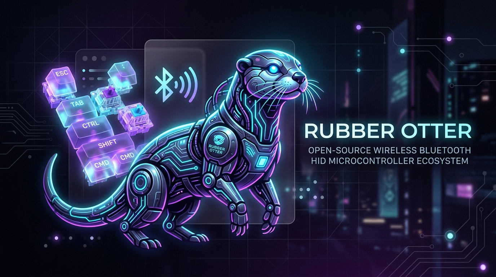
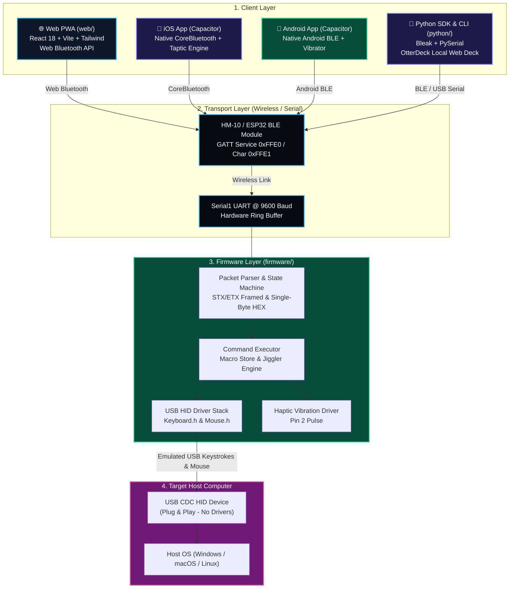

<p align="center">
  
</p>

# 🦦 Rubber Otter — Unified Bluetooth HID Ecosystem

[](https://github.com/AtaCanYmc/RubberOtter/actions/workflows/ci-firmware.yml)
[](https://github.com/AtaCanYmc/RubberOtter/actions/workflows/ci-python.yml)
[](https://github.com/AtaCanYmc/RubberOtter/actions/workflows/ci-web.yml)
[](https://github.com/AtaCanYmc/RubberOtter/actions/workflows/cd-github-pages.yml)
[](LICENSE)

**Rubber Otter** is a complete, modular, and open-source **wireless USB HID automation ecosystem**. It empowers you to control target host computers (Windows, macOS, Linux) with precision keystroke injection, virtual multi-touch mouse trackpad movements, media controls, presentation clicker timers, and persistent EEPROM macros over Bluetooth Low Energy (HM-10 / ESP32) and USB CDC Serial.

---

## 🌟 Ecosystem Highlights

- **🌐 Precision Web Workstation & PWA**: React 18 + Vite + TypeScript interface with header-integrated desktop navigation and responsive mobile touch bar.
- **📱 Native Mobile Packaging (Ionic Capacitor 6+)**: Packaged natively for **iOS (Apple App Store / TestFlight)** with direct **CoreBluetooth** and **Android (Google Play Store)** with native BLE & Taptic Engine haptics.
- **🐍 Python SDK & OtterDeck Dashboard**: Asynchronous Bleak & PySerial client library, rich CLI terminal tools, and an embedded Flask local web dashboard.
- **⚡ ATmega32U4 Firmware**: Highly optimized Arduino / PlatformIO C++ firmware with non-blocking mouse jiggler, hardware ring buffers, and STX/ETX XOR-checksum framing.
- **🌍 5 Interface Languages**: English (🇬🇧), Türkçe (🇹🇷), Deutsch (🇩🇪), Français (🇫🇷), and Español (🇪🇸).
- **🌓 Adaptive Dual-Theme Engine**: Obsidian Dark (`#09090b`), Clean White (`#ffffff`), and OS System sync.

---

## 📐 System Architecture



---

## 🗂️ Monorepo Structure

```text
RubberOtter/
├── firmware/                     # ⚡ C++ / PlatformIO / Arduino Firmware (ATmega32U4)
│   ├── platformio.ini           # PlatformIO multi-environment configuration
│   ├── src/                     # Modular firmware source (Parser, Executor, Store)
│   └── tests/                   # Native & Host integration tests
│
├── python/                       # 🐍 Python SDK, CLI Tool & OtterDeck Dashboard
│   ├── pyproject.toml           # PEP 517/668 packaging definition
│   ├── rubberotter/             # Core Python package (client, transports, cli, dashboard)
│   └── tests/                   # Unittest suite (15 passing tests)
│
├── web/                          # 🌐 React 18 + Vite PWA + 📱 Capacitor Mobile Apps
│   ├── src/                     # Workstation components (Text, Media, Trackpad, Macros)
│   ├── src/i18n/                # Localization engine (EN, TR, DE, FR, ES)
│   ├── ios/                     # 🍎 Native Xcode project (Capacitor)
│   ├── android/                 # 🤖 Native Android Studio project (Capacitor)
│   ├── capacitor.config.ts      # Native Capacitor app configuration
│   └── vite.config.ts           # Vite build & PWA configuration
│
├── docs/                         # 📖 Ecosystem Technical Documentation
│   ├── protocol-spec.md         # STX/ETX Framed Binary & Hex Command Specification
│   ├── hardware-wiring.md       # HM-10 BLE & Pro Micro wiring schematics
│   ├── MOBILE_PACKAGING.md      # iOS App Store & Android Google Play packaging guide
│   └── architecture.md          # Architectural deep-dive
│
├── .github/workflows/            # 🚀 Unified Matrix CI/CD Workflows
├── Makefile                      # 🛠️ Monorepo developer automation commands
└── release-please-config.json    # 🏷️ Semantic release configuration
```

---

## 🚀 Quick Starts

### 1. 🌐 Web Client & 📱 Mobile App (`web/`)
Run the Progressive Web App in any browser or build for mobile:

```bash
cd web
npm install
npm run dev

# Sync distribution to native iOS & Android:
npm run cap:sync

# Open in native IDEs:
npm run cap:open:ios      # Opens in Xcode
npm run cap:open:android  # Opens in Android Studio
```

### 2. 🐍 Python SDK & CLI (`python/`)
Install and use the Python client tool:

```bash
cd python
pip install -e .

# Scan for BLE Rubber Otter devices
rubberotter scan

# Type automated keystrokes
rubberotter type "Hello from Rubber Otter!"

# Launch the embedded OtterDeck local web dashboard
rubberotter dashboard --port 8080
```

#### Python Scripting Example:
```python
from rubberotter import RubberOtter

with RubberOtter() as otter:
    otter.vibrate(100)
    otter.type("echo 'Hello World!'\n")
    otter.jiggler_toggle()
```

### 3. ⚡ ATmega32U4 Firmware (`firmware/`)
Compile and flash the firmware using [PlatformIO](https://platformio.org/):

```bash
cd firmware

# Flash to Arduino Leonardo / Pro Micro 5V
platformio run -e pro_micro -t upload
```

---

## 🛠️ Developer Make Commands

The root `Makefile` automates all environment setups, testing, and multi-platform compilation:

```bash
make install          # Set up virtual environment and install Web & Python dependencies
make test             # Run 15 Python unit tests and Web TypeScript validation
make build            # Build Web PWA, Python package, and PlatformIO firmware
make mobile-sync      # Sync Web bundle to iOS and Android Capacitor projects
make mobile-android   # Launch Android Studio directly with Rubber Otter project
make mobile-ios       # Launch Xcode directly with Rubber Otter iOS project
make dev-web          # Start Web PWA Vite local development server
make clean            # Clean all build artifacts, caches, and virtualenvs
```

---

## 🗺️ Protocol Command Mapping

| Category | Action | Hex Code | Host Execution |
| :--- | :--- | :--- | :--- |
| **Media** | Play / Pause | `0x11` | Media Play/Pause toggle |
| | Next Track | `0x12` | Media Next Track |
| | Previous Track | `0x13` | Media Previous Track |
| | Volume Up / Down | `0x14` / `0x15` | Media Volume step |
| | Mute Toggle | `0x16` | Media Mute |
| **Presentation** | Next / Prev Slide | `0x21` / `0x22` | Right / Left Arrow (`KEY_RIGHT_ARROW`) |
| | Fullscreen / Black | `0x23` / `0x24` | F5 (`KEY_F5`) / 'B' |
| **Security** | Lock Screen | `0x31` | `Win + L` / `Ctrl + Cmd + Q` |
| | Mouse Jiggler | `0x32` | Non-blocking periodic micro-movements |
| | Task Manager | `0x33` | `Ctrl + Shift + Esc` / `Cmd + Opt + Esc` |
| | Show Desktop | `0x34` | `Win + D` / `Cmd + F3` |
| | Vibration Pulse | `0x35` | Pin 2 haptic pulse |
| **Gaming** | CS Buy Armor+Helm | `0x41` | Buy chain (`'b' -> 4 -> 2`) |
| **Trackpad** | Move Vector | `0x80` | `[0x80, deltaX, deltaY]` relative move |
| | Left / Right Click | `0x81` / `0x82` | `Mouse.click(MOUSE_LEFT / RIGHT)` |
| | Scroll Up / Down | `0x84` / `0x85` | `Mouse.move(0, 0, 1 / -1)` |

---

## 📖 Further Documentation

- [📱 Native Mobile Packaging & Store Release (iOS & Android)](docs/MOBILE_PACKAGING.md)
- [📦 Protocol Framing Specification (STX/ETX & Hex Codes)](docs/protocol-spec.md)
- [🔌 Hardware Wiring & Safety Guide](docs/hardware-wiring.md)
- [🏗️ Full System Architecture Deep-Dive](docs/architecture.md)

---

## 📄 License

This project is open source and licensed under the [Apache 2.0 License](LICENSE).
