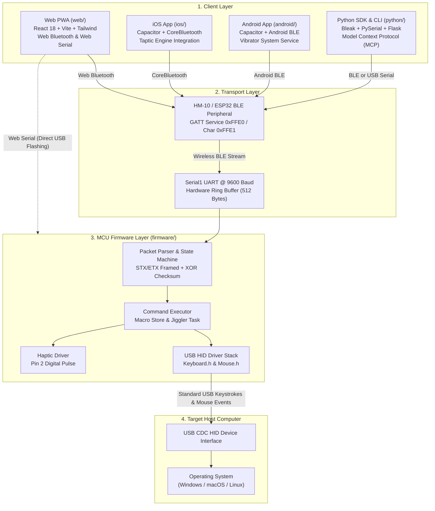

<p align="center">
  
</p>

# Rubber Otter

[](https://github.com/AtaCanYmc/RubberOtter/actions/workflows/ci-firmware.yml)
[](https://github.com/AtaCanYmc/RubberOtter/actions/workflows/ci-python.yml)
[](https://github.com/AtaCanYmc/RubberOtter/actions/workflows/ci-web.yml)
[](https://github.com/AtaCanYmc/RubberOtter/actions/workflows/cd-github-pages.yml)
[](LICENSE)

Rubber Otter is an open-source wireless USB Human Interface Device (HID) automation ecosystem. It allows client devices to inject keystrokes, execute relative mouse cursor movements, trigger media playback controls, run presentation timers, and store non-volatile macros on target host computers (Windows, macOS, Linux) over Bluetooth Low Energy (HM-10 or ESP32) and USB CDC Serial.

## Table of Contents

- [System Architecture](#system-architecture)
- [Monorepo Layout](#monorepo-layout)
- [Platform Releases and Artifacts](#platform-releases-and-artifacts)
- [Quick Start Guides](#quick-start-guides)
  - [Web Workstation and Native Mobile](#1-web-workstation-and-native-mobile-web)
  - [Python SDK, CLI, and MCP Server](#2-python-sdk-cli-and-mcp-server-python)
  - [Firmware Flashing](#3-firmware-flashing-firmware)
- [Root Automation Commands](#root-automation-commands)
- [Protocol Specification Summary](#protocol-specification-summary)
- [Frequently Asked Questions](#frequently-asked-questions)
- [Governance and Contributing](#governance-and-contributing)
- [License](#license)

## System Architecture



## Monorepo Layout

| Directory | Scope | Primary Technologies | Documentation |
| :--- | :--- | :--- | :--- |
| [`firmware/`](firmware/) | Embedded C++ microcontroller firmware. | PlatformIO, Arduino, ATmega32U4, C++11 | [firmware/README.md](firmware/README.md) |
| [`web/`](web/) | Desktop and mobile browser workstation. | React 18, TypeScript, Vite, Tailwind CSS | [web/README.md](web/README.md) |
| [`android/`](android/) | Native Android Studio packaging project. | Capacitor 8, Kotlin, Gradle 8.11, JDK 21 | [android/README.md](android/README.md) |
| [`ios/`](ios/) | Native Xcode iOS packaging project. | Capacitor 8, Swift Package Manager, Xcode | [ios/README.md](ios/README.md) |
| [`python/`](python/) | Client SDK, CLI, MCP Server, and OtterDeck. | Python 3.10+, Bleak, PySerial, Flask | [python/README.md](python/README.md) |
| [`docs/`](docs/) | Ecosystem design, wiring, and protocol specs. | Technical specifications and schematics | [docs/protocol-spec.md](docs/protocol-spec.md) |
| [`.github/`](.github/) | CI/CD matrix and automation workflows. | GitHub Actions, Release Please, Dependabot | [CONTRIBUTING.md](CONTRIBUTING.md) |

## Platform Releases and Artifacts

Standalone artifacts are published automatically on [GitHub Releases](https://github.com/AtaCanYmc/RubberOtter/releases) via dedicated workflow dispatchers:

| Platform | Channel | Build Artifact | Installation Method |
| :--- | :--- | :--- | :--- |
| **Android** | [Android Releases](https://github.com/AtaCanYmc/RubberOtter/releases?q=android) | `RubberOtter-Android.apk` | Download APK to device and allow installation from unknown sources. |
| **iOS** | [iOS Releases](https://github.com/AtaCanYmc/RubberOtter/releases?q=ios) | `RubberOtter-iOS-unsigned.ipa`<br/>`RubberOtter-iOS.app.zip` | Install via AltStore, Sideloadly, TrollStore, or deploy to booted iOS Simulator. |
| **Web PWA** | [Web Releases](https://github.com/AtaCanYmc/RubberOtter/releases?q=web) | Hosted PWA<br/>`RubberOtter-Web-PWA.zip` | Open [https://atacanymc.github.io/RubberOtter/](https://atacanymc.github.io/RubberOtter/) or extract ZIP to a local HTTP server. |
| **Python** | [PyPI Release](https://pypi.org/project/rubberotter/) | `rubberotter-*.tar.gz`<br/>`rubberotter-*.whl` | Install via `pip install rubberotter`. |

## Quick Start Guides

### 1. Web Workstation and Native Mobile (`web/`)

Run the Progressive Web App locally or build native mobile packages:

```bash
cd web
npm install
npm run dev

# Compile platform build distributions:
npm run build:web        # Staged in dist/web/
npm run build:android    # Builds APK via Gradle into dist/android/
npm run build:ios        # Builds iOS bundle via xcodebuild into dist/ios/

# Synchronize web assets to native mobile projects:
npm run cap:sync

# Open projects in native IDEs:
npm run cap:open:android
npm run cap:open:ios
```

### 2. Python SDK, CLI, and MCP Server (`python/`)

Install the client package in development mode:

```bash
cd python
pip install -e .

# Scan for nearby BLE peripherals and USB CDC serial ports
rubberotter scan

# Type automated keystroke string on host computer
rubberotter type "Hello from Rubber Otter\n"

# Start Model Context Protocol (MCP) server for Claude Desktop or Cursor
rubberotter mcp

# Launch local OtterDeck web control panel
rubberotter serve --web-port 8080
```

#### Scripting Example

```python
from rubberotter import RubberOtter

with RubberOtter() as otter:
    otter.vibrate(100)
    otter.type("echo 'Rubber Otter Active'\n")
    otter.jiggler_toggle()
```

### 3. Firmware Flashing (`firmware/`)

#### Option A: Zero-Install Web Flasher (Chromium Browsers)
1. Connect your ATmega32U4 board (SparkFun Pro Micro or Arduino Leonardo) via USB.
2. Open the [Rubber Otter Web Workstation](https://atacanymc.github.io/RubberOtter/) in Google Chrome, Microsoft Edge, or Brave.
3. Open **Settings > Hardware Flasher & Web Serial Tools** and click **Launch Flasher**.
4. Select your USB serial port from the browser device picker.
5. Select target board and click **Flash Firmware**. If the board does not respond, click **Trigger Bootloader (1200 bps)** to enter Caterina flash mode.

#### Option B: PlatformIO CLI

```bash
cd firmware

# Compile and upload to SparkFun Pro Micro 5V 16MHz
platformio run -e pro_micro -t upload

# Monitor serial diagnostics at 9600 baud
platformio device monitor -b 9600
```

## Root Automation Commands

The root `Makefile` provides unified targets for environment management, builds, and release packaging:

| Make Target | Description |
| :--- | :--- |
| `make install` | Creates Python virtual environment and installs npm and Python dependencies. |
| `make test` | Executes Python unit tests and performs Web TypeScript type-checking. |
| `make build-web` | Compiles Web PWA bundle and stages assets in `dist/web/`. |
| `make build-android` | Synchronizes Capacitor and compiles Android debug APK via Gradle. |
| `make build-ios` | Synchronizes Capacitor and compiles unsigned iOS application bundle via xcodebuild. |
| `make package-all` | Stages zip bundles and APK/IPA distributions in `dist/` for GitHub Releases. |
| `make build-firmware` | Compiles ATmega32U4 C++ firmware using PlatformIO Core. |
| `make mobile-sync` | Builds web application and syncs assets to both `android/` and `ios/`. |
| `make clean` | Deletes build outputs, virtualenvs, and intermediate compiler caches. |

## Protocol Specification Summary

Commands are transmitted inside framed binary packets or single-byte hexadecimal control codes.

### Frame Format (Host to Device)

| Offset | Field | Size | Description |
| :--- | :--- | :--- | :--- |
| `0` | `STX` | 1 byte | Delimiter byte `0x02`. |
| `1` | `VERSION` | 1 byte | Protocol version `0x01`. |
| `2` | `SEQ` | 1 byte | Host packet sequence counter. |
| `3` | `LEN_HI` | 1 byte | High byte of payload length. |
| `4` | `LEN_LO` | 1 byte | Low byte of payload length. |
| `5` | `PAYLOAD` | `N` bytes | Command string (maximum 384 bytes). |
| `5 + N` | `CHECKSUM` | 1 byte | XOR reduction over all `N` payload bytes. |
| `6 + N` | `ETX` | 1 byte | Delimiter byte `0x03`. |

### Single-Byte Immediate Control Codes

| Code | Category | Action | Host Emulation |
| :--- | :--- | :--- | :--- |
| `0x11` | Media | Play / Pause | Media Play/Pause toggle key. |
| `0x12` | Media | Next Track | Media Next Track key. |
| `0x13` | Media | Previous Track | Media Previous Track key. |
| `0x14` | Media | Volume Up | Media Volume Increment. |
| `0x15` | Media | Volume Down | Media Volume Decrement. |
| `0x16` | Media | Mute | Media Mute toggle. |
| `0x21` | Presentation | Next Slide | Right Arrow key (`KEY_RIGHT_ARROW`). |
| `0x22` | Presentation | Previous Slide | Left Arrow key (`KEY_LEFT_ARROW`). |
| `0x23` | Presentation | Start / Fullscreen | F5 key (`KEY_F5`). |
| `0x24` | Presentation | Black Screen | 'B' key. |
| `0x31` | Security | Workstation Lock | `Win + L` (Windows) or `Ctrl + Cmd + Q` (macOS). |
| `0x32` | Security | Mouse Jiggler | Periodic background micro-movements. |
| `0x33` | Security | Task Manager | `Ctrl + Shift + Esc` (Windows) or `Cmd + Opt + Esc` (macOS). |
| `0x34` | Security | Show Desktop | `Win + D` (Windows) or `Cmd + F3` (macOS). |
| `0x35` | Haptics | Vibration Burst | Triggers 100ms pulse on Pin 2. |
| `0x80` | Trackpad | Relative Move | Relative vector `[0x80, deltaX, deltaY]`. |
| `0x81` | Trackpad | Left Click | Left mouse button click. |
| `0x82` | Trackpad | Right Click | Right mouse button click. |
| `0x84` | Trackpad | Scroll Up | Vertical mouse wheel increment. |
| `0x85` | Trackpad | Scroll Down | Vertical mouse wheel decrement. |

## Frequently Asked Questions

#### Why use a custom BLE GATT service instead of the standard Bluetooth HID Profile?
Standard Bluetooth HID requires operating-system level Bluetooth pairing directly with the target host computer. Rubber Otter connects to the target computer strictly via physical USB CDC hardware. The BLE radio communicates with the operator's controller (phone, tablet, or secondary computer). This prevents the target computer from detecting wireless pairing activity in its Bluetooth settings.

#### How does the Caterina 1200bps bootloader reset mechanism operate over Web Serial?
ATmega32U4 microcontrollers running the Caterina bootloader monitor the USB CDC serial connection. When a client opens the serial port at 1200 baud and then immediately closes it, the firmware triggers a software reset into the Caterina bootloader. The bootloader exposes a temporary CDC port for 8 seconds, allowing the Web Serial flasher or PlatformIO to upload new firmware without requiring physical reset button presses.

#### What are the electrical safety requirements for the HM-10 module and vibration motor?
The HM-10 BLE module operates on 3.3V logic. Connecting a 5V MCU TX pin directly to HM-10 RX risks hardware degradation; a 1kΩ / 2kΩ resistive voltage divider is required. Furthermore, inductive DC vibration motors draw more current than the 40mA maximum GPIO limit of the ATmega32U4. The motor must be driven by an external N-channel MOSFET or transistor with a reverse-biased flyback diode across the motor terminals.

#### How does the firmware recover from dropped or corrupted UART bytes?
The firmware packet parser implements a ring buffer state machine. If corrupted bytes or invalid checksums occur, the parser transitions to an error state, transmits a negative acknowledgment (ACK code `3`), and seeks forward to the next valid `STX` delimiter byte (`0x02`) to regain synchronization.

## Governance and Contributing

- [Contributing Guidelines](CONTRIBUTING.md): Conventional Commits format, testing requirements, and PR checklists.
- [Code of Conduct](CODE_OF_CONDUCT.md): Contributor standards and enforcement procedures.
- [Security Policy](SECURITY.md): Vulnerability disclosure procedures, SLA, and threat boundaries.
- [Engineering Roadmap](ROADMAP.md): Project milestones and planned technical enhancements.

## License

Rubber Otter is open-source software licensed under the [Apache License, Version 2.0](LICENSE).
