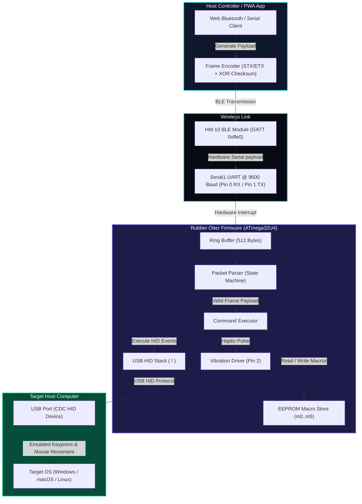
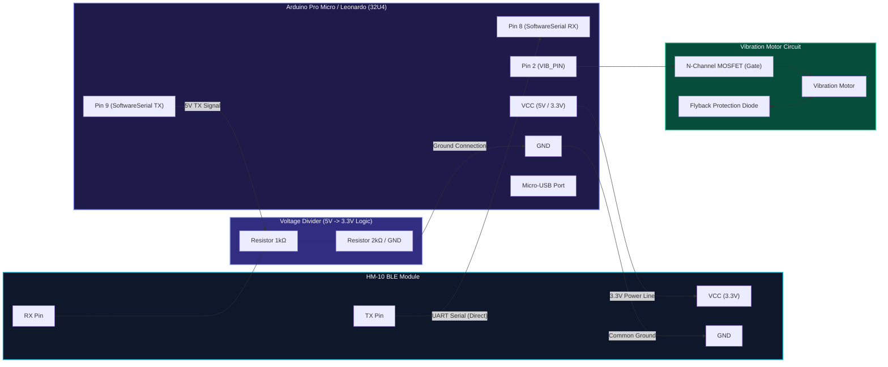

# 🦦 Rubber Otter — Modular Bluetooth HID Firmware

[](https://github.com/USERNAME/RubberOtter/actions/workflows/ci.yml)
[](https://platformio.org/)
[](LICENSE)
[](https://www.microchip.com/en-us/product/ATmega32u4)

A modular, production-grade **Arduino & PlatformIO C++ firmware** for ATmega32U4 microcontrollers (Arduino Leonardo / Pro Micro). Rubber Otter receives binary framed commands over a wireless serial link (HM-10 BLE module) and executes **USB HID Mouse & Keyboard emulation**, media key controls, non-blocking Mouse Jiggler tasks, vibration haptics, and EEPROM macro persistence.

---

## 📌 Table of Contents

- [📐 System Architecture](#-system-architecture)
- [🔌 Hardware Wiring & Safety](#-hardware-wiring--safety)
- [📦 Protocol Framing Specification](#-protocol-framing-specification)
- [⌨️ Command Set Reference](#%EF%B8%8F-command-set-reference)
- [💾 EEPROM Macro Storage](#-eeprom-macro-storage)
- [🛠️ Build & Upload Instructions](#%EF%B8%8F-build--upload-instructions)
- [💻 CLion IDE Integration](#-clion-ide-integration)
- [🚀 Continuous Integration (CI)](#-continuous-integration-ci)
- [🧰 Developer Tools & Scripts](#-developer-tools--scripts)
- [❓ Troubleshooting & Security](#-troubleshooting--security)

---

## 📐 System Architecture



### Modular Code Architecture (`src/`)

- [`src/Hardware.h`](file:///Users/atacan/CLionProjects/RubberOtter/src/Hardware.h) / `Hardware.cpp`: Hardware pin setup (`VIB_PIN = 2`), hardware UART (`Serial1`), optional `SoftwareSerial`, and AT+NAME BLE configuration routines.
- [`src/Protocol.h`](file:///Users/atacan/CLionProjects/RubberOtter/src/Protocol.h): Framing constants (`STX = 0x02`, `ETX = 0x03`, `VERSION = 0x01`), ring buffer sizes (`512`), and payload limits (`384`).
- [`src/PacketParser.h`](file:///Users/atacan/CLionProjects/RubberOtter/src/PacketParser.h) / `PacketParser.cpp`: Non-blocking ring buffer stream parser with state recovery and single-byte fallback handling.
- [`src/CommandExecutor.h`](file:///Users/atacan/CLionProjects/RubberOtter/src/CommandExecutor.h) / `CommandExecutor.cpp`: Command parsing, argument extraction, chaining (`&&` / `;`), mouse movements, and HID execution.
- [`src/InputHelpers.h`](file:///Users/atacan/CLionProjects/RubberOtter/src/InputHelpers.h) / `InputHelpers.cpp`: Text typing with escape characters, modifier holds, fallback media keys, mouse routines, and Mouse Jiggler polling.
- [`src/MacroStore.h`](file:///Users/atacan/CLionProjects/RubberOtter/src/MacroStore.h) / `MacroStore.cpp`: Non-volatile EEPROM storage routines for slots `m0` through `m5`.
- [`src/Utils.h`](file:///Users/atacan/CLionProjects/RubberOtter/src/Utils.h) / `Utils.cpp`: String trimming, case-insensitive comparison, integer parsing, and ACK generation.
- [`src/RubberOtter.ino`](file:///Users/atacan/CLionProjects/RubberOtter/src/RubberOtter.ino): Main sketch entry point with `setup()` and non-blocking `loop()`.

---

## 🔌 Hardware Wiring & Safety



### Pin Layout Mapping

| Component | Pin (Pro Micro / Leonardo) | Target Pin / Description |
| :--- | :--- | :--- |
| **HM-10 TX** | **Pin 8** (`RX_PIN_SOFT`) | SoftwareSerial RX (Arduino receives BLE data) |
| **HM-10 RX** | **Pin 9** (`TX_PIN_SOFT`) | SoftwareSerial TX (via 1kΩ / 2kΩ voltage divider) |
| **Vibration Motor** | **Pin 2** (`VIB_PIN`) | Transistor / N-Channel MOSFET Gate driver |
| **Hardware UART (Optional)** | **Pin 0 (RX1) / Pin 1 (TX1)** | Alternate HardwareSerial1 configuration |

> [!IMPORTANT]
> **Power & Voltage Safety**:
> - Never supply 5V directly to the HM-10 BLE module logic pins; use 3.3V or a voltage divider (1kΩ / 2kΩ) on the Arduino TX line.
> - Do **NOT** drive the vibration motor directly from an ATmega32U4 I/O pin. Always use an N-channel MOSFET or transistor with a flyback diode.

---

## 📦 Protocol Framing Specification

All communications use fixed binary framing to ensure byte stream resynchronization and host ACK validation.

### 1. Transmit Frame (Host → Device)

| Field | Offset (Bytes) | Size | Value / Range | Description |
| :--- | :--- | :--- | :--- | :--- |
| **STX** | `0` | 1 byte | `0x02` | Start of Text delimiter |
| **VERSION** | `1` | 1 byte | `0x01` | Protocol Version identifier |
| **SEQ** | `2` | 1 byte | `0x00 - 0xFF` | Host Sequence Counter (returned in ACK) |
| **LEN_HI** | `3` | 1 byte | `0x00 - 0x01` | High byte of Payload Length (Big-Endian) |
| **LEN_LO** | `4` | 1 byte | `0x00 - 0xFF` | Low byte of Payload Length (Big-Endian) |
| **PAYLOAD** | `5` | `N` bytes | ASCII String | Command payload (Max 384 bytes) |
| **CHECKSUM**| `5 + N` | 1 byte | `0x00 - 0xFF` | XOR checksum of all `N` payload bytes |
| **ETX** | `6 + N` | 1 byte | `0x03` | End of Text delimiter |

### 2. Acknowledge (ACK) Frame (Device → Host)

| Field | Offset (Bytes) | Size | Value | Description |
| :--- | :--- | :--- | :--- | :--- |
| **STX** | `0` | 1 byte | `0x02` | Start of Text delimiter |
| **VERSION** | `1` | 1 byte | `0x01` | Protocol Version identifier |
| **SEQ** | `2` | 1 byte | Matches RX SEQ | Sequence Counter matching request frame |
| **STATUS** | `3` | 1 byte | `0x01` / `0x00` | Status (`1` = Success, `0` = Error) |
| **CODE** | `4` | 1 byte | `0x00 - 0x03` | Error Code (`0`: OK, `1`: Parse Error, `2`: Len Exceeded, `3`: Checksum Error) |
| **ETX** | `5` | 1 byte | `0x03` | End of Text delimiter |

---

## ⌨️ Command Set Reference

Commands are passed as ASCII payloads inside framed packets. Multiple commands can be chained in a single payload using `&&` or `;`.

| Command Category | Command Syntax | Description | Example |
| :--- | :--- | :--- | :--- |
| **System** | `help`, `?` | Outputs help documentation over Serial & BLE | `help` |
| **System** | `ble name "<name>"` | Sends `AT+NAME` command to rename HM-10 | `ble name "Otter"` |
| **Text Typing** | `type "..."` | Types text (supports `\n`, `\t`, `\"` escapes) | `type "Hello\n"` |
| **Delay** | `delay <ms>` | Pauses execution for `<ms>` milliseconds | `delay 250` |
| **Simple Keys**| `enter`, `tab`, `backspace` | Sends common control keypresses | `enter` |
| **Modifiers** | `press <mod> <ms>` | Press & release modifier (`shift`, `ctrl`, `alt`, `gui`) | `press shift 50` |
| **Modifiers** | `hold <mod>` / `release <mod>` | Continuously holds or releases modifier key | `hold ctrl && type "a" && release ctrl` |
| **Haptics** | `vibrate <ms>` | Pulses vibration motor on `VIB_PIN` | `vibrate 100` |
| **Media Keys** | `media <cmd>` | Controls `play_pause`, `volume_up`, `volume_down`, `next`, `prev`, `mute` | `media volume_up` |
| **Mouse Move** | `mouse move <dx> <dy>` | Executes relative USB mouse HID cursor movement | `mouse move 10 -5` |
| **Mouse Click**| `mouse click <left\|right\|middle>`| Triggers single mouse click | `mouse click left` |
| **Mouse Scroll**| `mouse scroll <amount>`| Scrolls mouse wheel vertically | `mouse scroll 2` |
| **Jiggler** | `jiggler <on\|off\|toggle>`| Toggles background Mouse Jiggler micro-movements | `jiggler toggle` |
| **Macros** | `macro define mX { ... }` | Saves command sequence to EEPROM slot `m0`..`m5` | `macro define m0 { type "Hi" && enter }` |
| **Macros** | `macro run mX` | Executes macro sequence stored in slot `m0`..`m5` | `macro run m0` |

---

## 💾 EEPROM Macro Storage

- Rubber Otter allocates non-volatile EEPROM memory for **6 macro slots** (`m0` through `m5`), with a maximum payload length of `256` bytes per slot (`MACRO_SLOT_SIZE`).
- Defined macros persist across board reboots and USB disconnects.
- Magic byte validation ensures EEPROM slots are cleanly initialized to empty state on first boot.

> [!WARNING]
> EEPROM memory has a finite write endurance (typically ~100,000 write cycles). Avoid writing macro definitions inside rapid automated loops.

---

## 🛠️ Build & Upload Instructions

### 1. PlatformIO (Recommended)

Install PlatformIO CLI via Python or Homebrew:

```bash
# Using Python pip
python3 -m pip install --user -U platformio

# Using Homebrew (macOS)
brew install platformio
```

#### Build Environments Matrix

| Environment | Board Target | HID Stack | Command |
| :--- | :--- | :--- | :--- |
| `leonardo` | Arduino Leonardo | Standard `<Keyboard.h>` | `platformio run -e leonardo` |
| `pro_micro` | SparkFun Pro Micro 16MHz | Standard `<Keyboard.h>` | `platformio run -e pro_micro` |
| `leonardo_hid` | Arduino Leonardo | Extended `<HID-Project.h>` | `platformio run -e leonardo_hid` |
| `pro_micro_hid` | SparkFun Pro Micro 16MHz | Extended `<HID-Project.h>` | `platformio run -e pro_micro_hid` |

#### Upload Firmware

```bash
# Upload to Arduino Leonardo
platformio run -e leonardo -t upload

# Upload to SparkFun Pro Micro (with verbose log)
platformio run -e pro_micro -t upload -v
```

> [!TIP]
> If Pro Micro upload fails to enter the bootloader, double-tap the physical Reset pin on the Pro Micro board right as PlatformIO outputs `Looking for upload port...`.

### 2. Arduino IDE

1. Open [`src/RubberOtter.ino`](file:///Users/atacan/CLionProjects/RubberOtter/src/RubberOtter.ino) in Arduino IDE.
2. Select target board: **Tools > Board > Arduino Leonardo** (or SparkFun Pro Micro).
3. Select serial port under **Tools > Port** and click **Upload**.

---

## 💻 CLion IDE Integration

Run PlatformIO compilation and flashing directly within CLion:

1. **Terminal Window**: Open `Alt+F12` / `Cmd+F12` and run `platformio run -e leonardo`.
2. **External Tools Setup**:
   - Go to **Preferences / Settings > Tools > External Tools > Add (+)**
   - **Name**: `PlatformIO: Build (leonardo)`
   - **Program**: `/usr/local/bin/platformio` (or output of `which platformio`)
   - **Arguments**: `run -e leonardo`
   - **Working Directory**: `$ProjectFileDir$`

---

## 🚀 Continuous Integration & Continuous Deployment (CI/CD)

The repository includes automated GitHub Actions workflows:

- **CI Pipeline (`.github/workflows/ci.yml`)**: Builds all four PlatformIO matrix environments (`leonardo`, `pro_micro`, `leonardo_hid`, `pro_micro_hid`) and runs static analysis on every push/PR.
- **Automated Release (`.github/workflows/release.yml`)**: Automatically compiles and attaches all 4 binary `.hex` files to GitHub Releases upon tag creation (`v*.*.*`).

To test CI builds locally, execute:
```bash
chmod +x scripts/ci-local.sh
./scripts/ci-local.sh
```

---

## 🧰 Developer Tools & CLI

Complete documentation for all firmware capabilities and commands is available in **[`docs/COMMANDS_AND_CAPABILITIES.md`](file:///Users/atacan/CLionProjects/RubberOtter/docs/COMMANDS_AND_CAPABILITIES.md)**, CLI guide in **[`docs/CLI_REFERENCE.md`](file:///Users/atacan/CLionProjects/RubberOtter/docs/CLI_REFERENCE.md)**, and script guides in **[`docs/TOOLS_AND_SCRIPTS.md`](file:///Users/atacan/CLionProjects/RubberOtter/docs/TOOLS_AND_SCRIPTS.md)**.

### Unified CLI Tool (`scripts/cli.py`)
Discover devices, execute payload commands, manage EEPROM macros, and launch REPL console:

```bash
# Install dependencies
pip3 install pyserial bleak

# Scan for USB Serial ports & BLE devices
python3 scripts/cli.py scan

# Send commands directly (auto-detects port)
python3 scripts/cli.py send "delay 50"
python3 scripts/cli.py jiggler toggle
python3 scripts/cli.py vibrate 150

# Launch interactive REPL console
python3 scripts/cli.py shell

# Machine-readable JSON mode
python3 scripts/cli.py scan --json
```

---

## ❓ Troubleshooting & Security

### Troubleshooting

- **No ACK Received**:
  - Verify HM-10 BLE TX/RX lines are connected correctly (HM-10 TX → MCU Pin 0 RX1, HM-10 RX ← MCU Pin 1 TX1 via divider).
  - Confirm baud rate is set to `9600` on hardware `Serial1`.
- **Wrong Key Characters Typed**:
  - `Keyboard.write` defaults to US English layout. If using alternative layouts, use `HID-Project` keyboard definitions.
- **Macro Data Not Persisting**:
  - Verify EEPROM size on board and ensure `macro define` syntax includes proper braces: `macro define m0 { ... }`.

### Security Considerations

> [!CAUTION]
> Do not store unencrypted passwords or secrets in EEPROM or transmit sensitive strings over unencrypted BLE links. Always validate checksums and sequence numbers on the host side.

---

## 📜 License

This project is licensed under the [Apache License 2.0](LICENSE).
