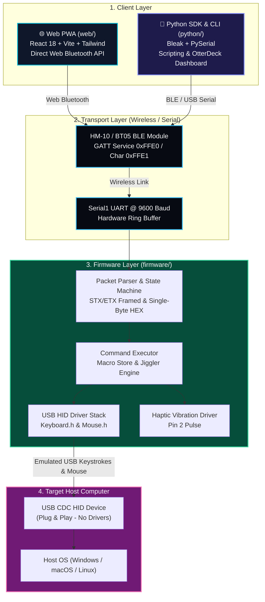

# 🦦 Rubber Otter — Unified Bluetooth HID Ecosystem

[](https://github.com/AtaCanYmc/RubberOtter/actions/workflows/ci-firmware.yml)
[](https://github.com/AtaCanYmc/RubberOtter/actions/workflows/ci-python.yml)
[](https://github.com/AtaCanYmc/RubberOtter/actions/workflows/ci-web.yml)
[](https://github.com/AtaCanYmc/RubberOtter/actions/workflows/cd-github-pages.yml)
[](LICENSE)

**Rubber Otter** is a complete, modular, and open-source **wireless USB HID automation ecosystem**. It allows you to control a target computer (Windows, macOS, Linux) via keystroke injection, virtual mouse movements, media keys, presentation controls, and persistent EEPROM macros over Bluetooth Low Energy (BLE HM-10) and USB CDC Serial.

---

## 📐 System Architecture



---

## 🗂️ Monorepo Structure

```text
RubberOtter/
├── firmware/                     # ⚡ C++ / PlatformIO / Arduino Firmware (ATmega32U4)
│   ├── platformio.ini           # PlatformIO multi-environment configuration
│   ├── src/                     # Firmware modular source files (Parser, Executor, Store)
│   ├── tests/                   # Native & Host integration tests
│   └── docs/                    # Firmware-specific technical docs
│
├── python/                       # 🐍 Python SDK, CLI Tool & OtterDeck Dashboard
│   ├── pyproject.toml           # PyPI packaging definition
│   ├── rubberotter/             # Core Python package (client, transports, cli, dashboard)
│   └── tests/                   # Comprehensive unittest suite
│
├── web/                          # 🌐 React 18 + TypeScript + Vite + Tailwind PWA
│   ├── src/                     # PWA components (Media, Trackpad, Remote, Macro Builder)
│   ├── public/                  # PWA icons, manifest, and service worker
│   └── vite.config.ts           # Vite build & PWA configuration
│
├── docs/                         # 📖 Shared Ecosystem Documentation
│   ├── protocol-spec.md         # STX/ETX Framed Binary & Hex Command Specification
│   ├── hardware-wiring.md       # HM-10 BLE & Pro Micro wiring schematics
│   └── architecture.md          # Architectural deep-dive
│
├── .github/workflows/            # 🚀 Unified Matrix CI/CD Workflows
├── Makefile                      # 🛠️ Root developer automation commands
└── release-please-config.json    # 🏷️ Monorepo multi-package semantic versioning
```

---

## 🚀 Quick Starts

### 1. 🌐 Web PWA Client (`web/`)
Run the Progressive Web App directly in any Web Bluetooth compatible browser (Chrome, Edge, Opera on Android/macOS/Windows/Linux):

```bash
cd web
npm install
npm run dev
```
> Or access the hosted live version on GitHub Pages!

### 2. 🐍 Python SDK & CLI (`python/`)
Install the Python package locally or directly into your virtual environment:

```bash
cd python
pip install -e .

# Scan for BLE Rubber Otter devices
rubberotter scan

# Type automated keystrokes
rubberotter type "Hello from Rubber Otter!"

# Launch the embedded OtterDeck local web dashboard
rubberotter dashboard --port 8080
```

#### Python Code Snippet:
```python
from rubberotter import RubberOtter

with RubberOtter() as otter:
    otter.vibrate(100)
    otter.type("Hello World!\n")
    otter.jiggler_toggle()
```

### 3. ⚡ ATmega32U4 Firmware (`firmware/`)
Compile and flash the firmware using [PlatformIO](https://platformio.org/):

```bash
cd firmware

# Flash to Arduino Leonardo / Pro Micro 5V
platformio run -e pro_micro -t upload
```

---

## 🛠️ Developer Commands

Use the root `Makefile` to build and test all components in one go:

```bash
make test           # Run Python unit tests and Web TypeScript validation
make build          # Build Web PWA, Python distribution, and compile firmware
make dev-web        # Start the Web PWA Vite development server
make dev-python     # Install Python package in editable mode
```

---

## 📖 Specifications & Reference

- [📦 Protocol Framing Specification (STX/ETX & Hex Codes)](docs/protocol-spec.md)
- [🔌 Hardware Wiring & Safety Guide](docs/hardware-wiring.md)

---

## 📄 License

This project is licensed under the [Apache 2.0 License](LICENSE).
