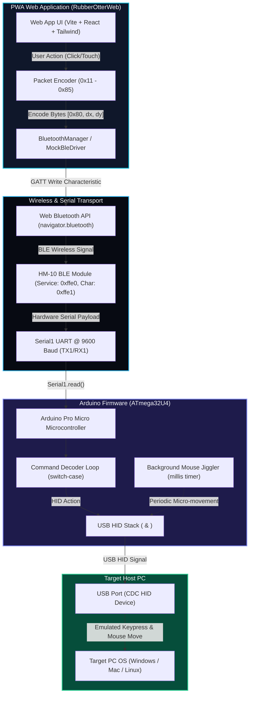
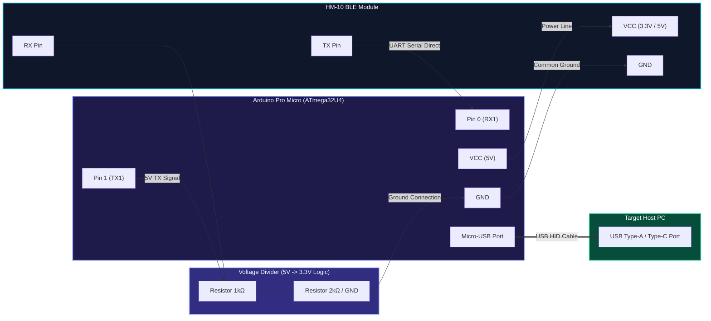

# Master-Key Bluetooth HID Bridge (RubberOtterWeb)

[](https://github.com/USERNAME/RubberOtterWeb/actions/workflows/ci.yml)
[](https://github.com/USERNAME/RubberOtterWeb/actions/workflows/cd-github-pages.yml)
[](LICENSE)
[](https://vitejs.dev)

A modern, responsive **Progressive Web Application (PWA)** built with **Vite, React, TypeScript, and Tailwind CSS** that connects to an **HM-10 BLE module** over the Web Bluetooth API (`navigator.bluetooth`) to control a target host PC via USB HID (keyboard & mouse emulation).

---

## 📐 Control Flow & Architecture



---

## ✨ Features

- 🎵 **Media Remote**: Big tactile buttons for Play/Pause, Next/Prev Track, Volume Up/Down, and Mute with animated audio spectrum bars.
- 📊 **Presentation Remote**: Slide advance controls (Left/Right Arrows), Fullscreen toggle (`F5`), Blank screen (`B`), and an integrated presentation stopwatch timer.
- 🔒 **Security & Utilities**: Workstation Lock (`Win + L`), Mouse Jiggler toggle switch with customizable interval timers, Task Manager shortcut (`Ctrl+Shift+Esc`), and Show Desktop (`Win+D`).
- 🎮 **Gaming & Custom Macros**: Built-in CS Armor & Helmet Buy macro (`0x41`) + Interactive Custom Macro Builder saved in `localStorage`.
- 🖱️ **Virtual Trackpad**: Interactive touch surface supporting multi-touch gestures (single tap for Left Click `0x81`, 2-finger tap for Right Click `0x82`), cursor tracking, scroll controls (`0x84`, `0x85`), and sensitivity slider (1.0x - 5.0x).
- 🤖 **In-Browser Hardware Simulator**: Toggleable Mock Driver allowing full app testing without needing a physical HM-10 module connected.
- 📜 **GATT Packet Terminal**: Live stream of all transmitted packets with timestamp, log category (`tx`, `info`, `warn`, `error`), Hex payload view, and copy logs functionality.
- 🔊 **Tactile Feedback**: Synthesized Web Audio API mechanical click sounds & mobile Web Haptics (`navigator.vibrate`).

---

## 🗺️ Single-Byte Protocol Map

| Mode | Command Action | Hex Code | Host HID Execution |
| :--- | :--- | :--- | :--- |
| **Media** | Play / Pause | `0x11` | Media Play/Pause key |
| | Next Track | `0x12` | Media Next Track |
| | Previous Track | `0x13` | Media Previous Track |
| | Volume Up | `0x14` | Media Volume Up |
| | Volume Down | `0x15` | Media Volume Down |
| | Mute Toggle | `0x16` | Media Mute |
| **Presentation** | Next Slide | `0x21` | Right Arrow (`KEY_RIGHT_ARROW`) |
| | Previous Slide | `0x22` | Left Arrow (`KEY_LEFT_ARROW`) |
| | Fullscreen | `0x23` | F5 (`KEY_F5`) |
| **Security** | Lock Screen | `0x31` | Windows + L (`KEY_LEFT_GUI` + `l`) |
| | Mouse Jiggler | `0x32` | Toggle non-blocking periodic mouse micro-movement |
| | Task Manager | `0x33` | Ctrl + Shift + Esc |
| | Show Desktop | `0x34` | Windows + D |
| **Gaming** | CS Buy Macro | `0x41` | Press `'b'` -> delay -> `'4'` -> delay -> `'2'` |
| **Trackpad** | Move Packet | `0x80` | `[0x80, deltaX, deltaY]` relative move |
| | Left Click | `0x81` | `Mouse.click(MOUSE_LEFT)` |
| | Right Click | `0x82` | `Mouse.click(MOUSE_RIGHT)` |
| | Middle Click | `0x83` | `Mouse.click(MOUSE_MIDDLE)` |
| | Scroll Up | `0x84` | `Mouse.move(0, 0, 1)` |
| | Scroll Down | `0x85` | `Mouse.move(0, 0, -1)` |

---

## ⚡ Quick Start

### 1. Installation
```bash
git clone https://github.com/USERNAME/RubberOtterWeb.git
cd RubberOtterWeb
npm install
```

### 2. Run Development Server
```bash
npm run dev
```
Open `http://localhost:3000` in Chrome, Edge, or Bluefy on iOS.

### 3. Production Build
```bash
npm run build
```

---

## 🔌 Hardware Wiring Diagram



---

## 📜 License

This project is licensed under the [Apache License 2.0](LICENSE).
