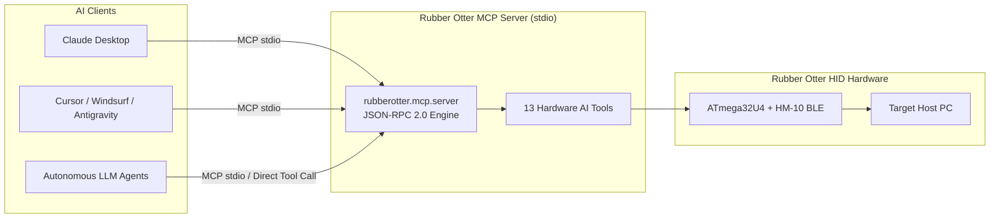

# 🤖 Rubber Otter Model Context Protocol (MCP) & AI Agent Tools

Rubber Otter includes native support for the **Model Context Protocol (MCP)** and modern **AI Agent Frameworks** (LangChain, CrewAI, OpenAI Function Calling, Anthropic Claude Tools).

This allows any AI assistant, LLM desktop app, or autonomous agent to wirelessly control host PCs, type commands, manipulate cursor vectors, navigate presentations, lock workstations, and trigger hardware haptics via the Rubber Otter ATmega32U4 controller.

---

## 🛠️ Model Context Protocol (MCP) Setup



### 1. Claude Desktop Integration

1. Generate your local executable configuration:
   ```bash
   rubberotter mcp --config-claude
   ```
2. Open `~/Library/Application Support/Claude/claude_desktop_config.json` (macOS) or `%APPDATA%\Claude\claude_desktop_config.json` (Windows) and add:
   ```json
   {
     "mcpServers": {
       "rubberotter": {
         "command": "python",
         "args": ["-m", "rubberotter.mcp.server"]
       }
     }
   }
   ```
3. Restart Claude Desktop. You will see the Rubber Otter hammer icon with 13 available tools!

### 2. Cursor / Windsurf / Antigravity Integration

Add the following to your `mcp.json` / MCP Server settings:
```json
{
  "name": "rubberotter",
  "command": "python",
  "args": ["-m", "rubberotter.mcp.server"],
  "type": "stdio"
}
```

---

## 🧰 Available MCP & AI Tools (13)

| Tool Name | Parameters | Description |
| :--- | :--- | :--- |
| `rubberotter_type` | `text` (str), `auto_enter` (bool) | Injects arbitrary keystrokes, shell commands, or source code. |
| `rubberotter_key_combo` | `key` (str) | Presses key shortcuts (`enter`, `tab`, `gui_l`, `f5`, `escape`). |
| `rubberotter_mouse_move` | `dx` (int), `dy` (int) | Performs relative mouse pointer displacement (-127 to 127 px). |
| `rubberotter_mouse_click` | `button` ('left'/'right'/'middle') | Executes virtual USB mouse click. |
| `rubberotter_mouse_scroll` | `direction` ('up'/'down'), `steps` (int) | Scrolls mouse wheel. |
| `rubberotter_media` | `action` ('play_pause', 'next', 'prev', 'vol_up', 'vol_down', 'mute') | Host audio and track controls. |
| `rubberotter_presenter` | `action` ('next_slide', 'prev_slide', 'fullscreen', 'black_screen') | Presentation slide navigation. |
| `rubberotter_lock` | None | Instantly locks workstation screen (`Win+L` / `Ctrl+Cmd+Q`). |
| `rubberotter_jiggler` | None | Toggles periodic mouse micro-movements against OS idle sleep. |
| `rubberotter_vibrate` | `duration_ms` (int) | Triggers physical Pin 2 haptic vibration pulse on MCU hardware. |
| `rubberotter_macro` | `macro_name` (str) | Executes predefined gaming or security macro sequence. |
| `rubberotter_scan` | `timeout` (float) | Discovers nearby Rubber Otter BLE devices. |
| `rubberotter_status` | None | Returns live connection telemetry and packet counters. |

---

## 🐍 Python AI Agent Integration (LangChain / OpenAI / Claude)

### Direct Tool Registry Usage
```python
from rubberotter.ai.tools import RubberOtterToolRegistry

# Initialize registry
registry = RubberOtterToolRegistry()

# 1. Export schemas for OpenAI Function Calling
openai_tools = [t.to_openai_tool() for t in registry.list_tools()]

# 2. Export schemas for Anthropic Claude Tools
claude_tools = [t.to_anthropic_tool() for t in registry.list_tools()]

# 3. Direct execution
result = registry.execute("rubberotter_type", {"text": "echo 'Hello from AI Agent!'", "auto_enter": True})
print(result)
```

### LangChain Custom Tool Example
```python
from langchain.tools import StructuredTool
from rubberotter.ai.tools import RubberOtterToolRegistry

registry = RubberOtterToolRegistry()
langchain_tools = []

for tool_def in registry.list_tools():
    langchain_tools.append(
        StructuredTool.from_function(
            func=tool_def.handler,
            name=tool_def.name,
            description=tool_def.description
        )
    )
```
