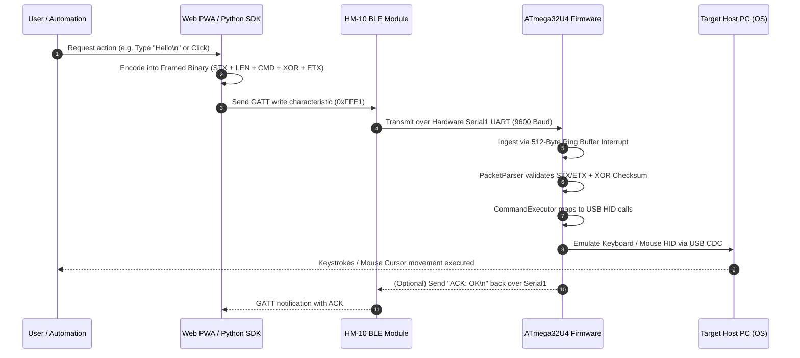

# 📐 Rubber Otter — System Architecture & Data Flow

This document details the internal architecture, cross-cutting concerns, and data flows of the Rubber Otter ecosystem across all three packages: **Firmware**, **Python SDK**, and **Web PWA**.

---

## 🏛️ Package Interactions

---

## 🔍 Layer Responsibilities

### 1. Firmware (`firmware/`)
- **Microcontroller**: Microchip ATmega32U4 running at 16MHz (5V logic).
- **Subsystems**:
  - `PacketParser`: State machine tracking STX (`0x02`), Length bytes, payload bytes, checksum validation, and ETX (`0x03`). Falls back smoothly to single-byte execution.
  - `CommandExecutor`: Parses strings, handles command chaining (`&&` / `;`), extracts arguments.
  - `InputHelpers`: Text unescaping (`\n`, `\t`, `\"`), key combinations with modifiers (`GUI`, `CTRL`, `ALT`, `SHIFT`), non-blocking mouse jiggler task polling.
  - `MacroStore`: EEPROM read/write routines for slots `m0` through `m5`.
  - `Hardware`: Pin assignments, baud rate configuration, vibration driver.

### 2. Python SDK & CLI (`python/`)
- **Core Package (`rubberotter`)**:
  - `RubberOtter`: Synchronous client using Bleak or PySerial with context manager support.
  - `AsyncRubberOtter`: Asynchronous `asyncio` client for event-driven systems.
  - `cli.py`: Full-featured terminal interface.
  - `dashboard.py`: Lightweight embedded HTTP server providing OtterDeck web UI.

### 3. Web PWA (`web/`)
- **Technology**: React 18, TypeScript, Tailwind CSS, Vite.
- **Web Bluetooth & Web Serial**: Connects via `navigator.bluetooth` to HM-10 GATT service `0xFFE0` / characteristic `0xFFE1`, and `navigator.serial` for zero-install direct USB hardware flashing.
- **Panels**: Media Remote, Presentation Remote, Security & Shortcuts, CS Buy / Custom Macro builder, Virtual Trackpad with multi-touch gestures, Hardware Flasher, Live Packet Terminal.

### 4. Native Mobile Applications (`ios/`, `android/`)
- **Framework**: Ionic Capacitor with standalone root native projects.
- **iOS (`ios/`)**: Native Swift workspace with Swift Package Manager plugins, direct CoreBluetooth, and Apple Taptic Engine haptics.
- **Android (`android/`)**: Native Gradle/Kotlin Android Studio project with Android Bluetooth LE and Vibrator services.
- **Build Output**: Automated builds produce unified binaries in `dist/web/`, `dist/android/` (`.apk`), and `dist/ios/` (`.app`).
