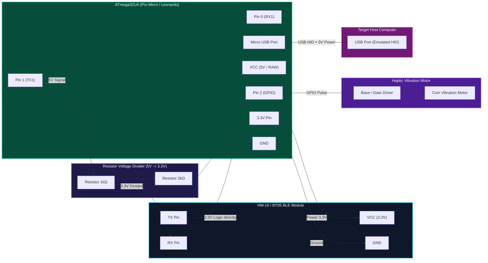

# 🔌 Rubber Otter — Hardware Wiring & Schematics

This document describes the circuit design and wiring pinout for building a Rubber Otter HID device using an **ATmega32U4** board (SparkFun Pro Micro 5V/16MHz or Arduino Leonardo), **HM-10 / BT05 BLE Module**, and an optional **Vibration Motor**.

---

## 📐 Circuit Schematic

---

## 📌 Pinout Mapping Table

| Component | Pin | Pro Micro / Leonardo Pin | Notes |
| :--- | :--- | :--- | :--- |
| **HM-10 BLE** | `VCC` | `3.3V` (or `VCC` if 5V tolerant) | Ensure module voltage compatibility |
| **HM-10 BLE** | `GND` | `GND` | Common ground |
| **HM-10 BLE** | `TX` | `Pin 0 (RX1)` | Direct connection (3.3V logic is read reliably by 5V ATmega32U4) |
| **HM-10 BLE** | `RX` | `Pin 1 (TX1)` via Divider | **Must protect HM-10 RX pin** with $1\text{k}\Omega / 2\text{k}\Omega$ divider from 5V TX1 |
| **Haptic Motor**| `SIG` | `Pin 2` | Active HIGH digital output (use 2N2222 NPN or MOSFET) |
| **Status LED** | `Built-in` | `Pin 17 (RXLED) / Pin 30 (TXLED)` | Hardware activity indication |

---

## ⚠️ Safety Guidelines

> [!CAUTION]
> **5V Logic Warning**: ATmega32U4 outputs 5V signals on digital pins. Directly connecting Pro Micro Pin 1 (TX1) to HM-10 RX pin without a voltage divider can permanently damage the Bluetooth module's receiver IC.
