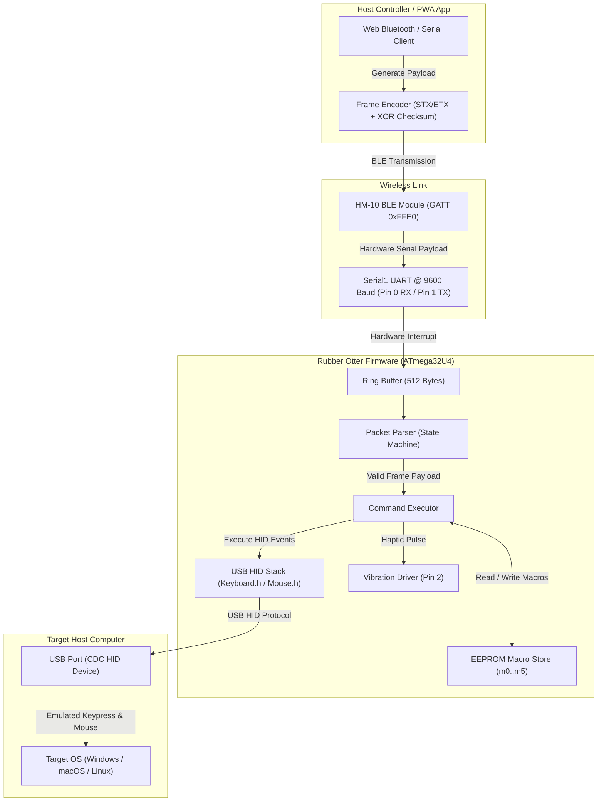
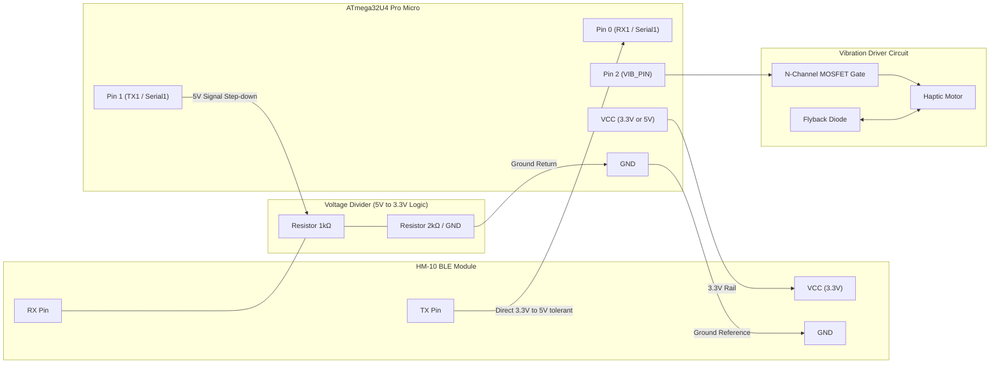

[← Back to Root Repository](../README.md)

# Rubber Otter Firmware

PlatformIO and Arduino C++ firmware for ATmega32U4 microcontrollers (SparkFun Pro Micro and Arduino Leonardo). Rubber Otter receives framed command packets over a wireless serial link (HM-10 BLE or ESP32) and executes USB HID Keyboard and Mouse injection, media controls, non-blocking mouse jiggling, and EEPROM macro persistence.

## Table of Contents

- [System Architecture](#system-architecture)
- [Hardware Wiring and Pinout](#hardware-wiring-and-pinout)
- [Protocol Framing Specification](#protocol-framing-specification)
- [Command Set Reference](#command-set-reference)
- [EEPROM Macro Storage](#eeprom-macro-storage)
- [Build and Upload Instructions](#build-and-upload-instructions)
- [Developer Tools and CLI](#developer-tools-and-cli)
- [Troubleshooting and Safety](#troubleshooting-and-safety)
- [License](#license)

## System Architecture



### Source File Layout

- [`src/Hardware.h`](src/Hardware.h) / `Hardware.cpp`: Pin configuration (`VIB_PIN = 2`), hardware UART initialization (`Serial1`), and BLE configuration routines.
- [`src/Protocol.h`](src/Protocol.h): Framing delimiters (`STX = 0x02`, `ETX = 0x03`, `VERSION = 0x01`), ring buffer capacity (512 bytes), and maximum payload length (384 bytes).
- [`src/PacketParser.h`](src/PacketParser.h) / `PacketParser.cpp`: Non-blocking stream state machine handling byte recovery and framing validation.
- [`src/CommandExecutor.h`](src/CommandExecutor.h) / `CommandExecutor.cpp`: Argument tokenization, command execution, and multi-command chaining via `&&` or `;`.
- [`src/InputHelpers.h`](src/InputHelpers.h) / `InputHelpers.cpp`: Keystroke injection with escape processing, mouse navigation, and jiggler scheduler.
- [`src/MacroStore.h`](src/MacroStore.h) / `MacroStore.cpp`: Non-volatile EEPROM storage routines for slots `m0` through `m5`.
- [`src/Utils.h`](src/Utils.h) / `Utils.cpp`: String manipulation, numeric parsing, and ACK packet generation.
- [`src/RubberOtter.ino`](src/RubberOtter.ino): Main setup and polling loop.

## Hardware Wiring and Pinout



### Pin Allocation

| Component | Pin on Pro Micro / Leonardo | Direction / Signal Type | Description |
| :--- | :--- | :--- | :--- |
| **HM-10 TX** | Pin 0 (`RX1`) | Input | Hardware UART receive line. |
| **HM-10 RX** | Pin 1 (`TX1`) | Output (via Divider) | Hardware UART transmit line stepped down to 3.3V. |
| **Vibration Motor** | Pin 2 (`VIB_PIN`) | Output (Digital) | Drives the gate of an N-channel MOSFET. |
| **Status LED** | Pin 17 (`RXLED`) / Pin 30 (`TXLED`) | Output | Built-in board activity indicators. |

> [!IMPORTANT]
> Never connect 5V logic signals directly to the HM-10 RX pin without a level shifter or voltage divider. Never drive an inductive vibration motor directly from an MCU GPIO pin.

## Protocol Framing Specification

Communication packets are enclosed in binary frames with length headers and an XOR payload checksum.

### Host to Device (Request Frame)

| Byte Offset | Size | Value Range | Field Name | Description |
| :--- | :--- | :--- | :--- | :--- |
| `0` | 1 byte | `0x02` | `STX` | Start of Text delimiter. |
| `1` | 1 byte | `0x01` | `VERSION` | Protocol Version. |
| `2` | 1 byte | `0x00 - 0xFF` | `SEQ` | Host sequence number. |
| `3` | 1 byte | `0x00 - 0x01` | `LEN_HI` | High byte of payload length (Big-Endian). |
| `4` | 1 byte | `0x00 - 0xFF` | `LEN_LO` | Low byte of payload length (Big-Endian). |
| `5` | `N` bytes | ASCII | `PAYLOAD` | Command string (maximum 384 bytes). |
| `5 + N` | 1 byte | `0x00 - 0xFF` | `CHECKSUM` | XOR reduction across all `N` payload bytes. |
| `6 + N` | 1 byte | `0x03` | `ETX` | End of Text delimiter. |

### Device to Host (Acknowledge Frame)

| Byte Offset | Size | Value Range | Field Name | Description |
| :--- | :--- | :--- | :--- | :--- |
| `0` | 1 byte | `0x02` | `STX` | Start of Text delimiter. |
| `1` | 1 byte | `0x01` | `VERSION` | Protocol Version. |
| `2` | 1 byte | `0x00 - 0xFF` | `SEQ` | Sequence number matching request frame. |
| `3` | 1 byte | `0x00 / 0x01` | `STATUS` | `0x01` indicates Success, `0x00` indicates Error. |
| `4` | 1 byte | `0x00 - 0x03` | `CODE` | Error code: `0`: OK, `1`: Parse Error, `2`: Overflow, `3`: Checksum Error. |
| `5` | 1 byte | `0x03` | `ETX` | End of Text delimiter. |

## Command Set Reference

Commands are supplied as ASCII strings inside the framed packet payload. Multiple commands can be chained using `&&` or `;`.

| Command | Arguments | Description | Example |
| :--- | :--- | :--- | :--- |
| `help` | None | Emits available commands over Serial and BLE. | `help` |
| `ble name` | `"<name>"` | Updates HM-10 broadcast name via AT+NAME. | `ble name "Otter"` |
| `type` | `"<text>"` | Injects keystroke characters with escape parsing. | `type "Hello\n"` |
| `delay` | `<ms>` | Blocks execution for the specified milliseconds. | `delay 250` |
| `enter` | None | Presses and releases the Enter key. | `enter` |
| `tab` | None | Presses and releases the Tab key. | `tab` |
| `backspace` | None | Presses and releases the Backspace key. | `backspace` |
| `press` | `<mod> <ms>` | Pulses a modifier key (`shift`, `ctrl`, `alt`, `gui`). | `press shift 50` |
| `hold` | `<mod>` | Holds modifier down until explicit release. | `hold ctrl` |
| `release` | `<mod>` | Releases currently held modifier key. | `release ctrl` |
| `vibrate` | `<ms>` | Pulses the vibration motor pin. | `vibrate 150` |
| `media` | `<action>` | Triggers consumer media control keys. | `media volume_up` |
| `mouse move` | `<dx> <dy>` | Injects relative cursor movement vector. | `mouse move 10 -5` |
| `mouse click` | `<left\|right>` | Injects single mouse button click. | `mouse click left` |
| `mouse scroll` | `<amount>` | Injects vertical wheel rotation. | `mouse scroll 2` |
| `jiggler` | `<on\|off\|toggle>` | Controls the background mouse jiggler. | `jiggler toggle` |
| `macro define` | `mX { <cmd> }` | Writes macro sequence to EEPROM slot `m0`..`m5`. | `macro define m0 { type "hi" }` |
| `macro run` | `mX` | Executes macro stored in EEPROM slot `m0`..`m5`. | `macro run m0` |

## EEPROM Macro Storage

The MCU reserves non-volatile EEPROM storage for 6 macro slots (`m0` through `m5`). Each slot accommodates up to 256 bytes (`MACRO_SLOT_SIZE`).

- Stored macros persist across power cycles and USB disconnections.
- A magic header byte (`0xAA`) validates slot integrity upon read. Uninitialized slots return a clean parse error.
- Macro execution parses stored commands through the shared execution engine.

## Build and Upload Instructions

PlatformIO Core is the recommended build system.

### Build Environments

| Environment | Board Target | Clock Rate | HID Stack |
| :--- | :--- | :--- | :--- |
| `pro_micro` | SparkFun Pro Micro | 16 MHz | Standard Arduino HID (`Keyboard.h`, `Mouse.h`) |
| `leonardo` | Arduino Leonardo | 16 MHz | Standard Arduino HID |
| `pro_micro_hid` | SparkFun Pro Micro | 16 MHz | Extended `HID-Project` library |
| `leonardo_hid` | Arduino Leonardo | 16 MHz | Extended `HID-Project` library |

### Compilation and Upload Commands

```bash
# Build firmware for Pro Micro
platformio run -e pro_micro

# Upload to Pro Micro via USB serial
platformio run -e pro_micro -t upload

# Monitor serial diagnostics
platformio device monitor -b 9600
```

> [!TIP]
> If Pro Micro upload times out waiting for a serial port, initiate a Caterina bootloader reset by temporarily grounding the RST pin twice within 500 milliseconds.

## Developer Tools and CLI

The repository includes a standalone Python CLI tool in `scripts/cli.py` for testing firmware directly over serial or BLE:

```bash
# Scan for connected hardware
python3 scripts/cli.py scan

# Send test command to detected device
python3 scripts/cli.py send "vibrate 100"

# Toggle jiggler
python3 scripts/cli.py jiggler toggle
```

## Troubleshooting and Safety

### No Response or ACK Timeout
1. Confirm hardware wiring. The HM-10 TX pin must route to ATmega32U4 Pin 0 (`RX1`).
2. Verify baud rate. The firmware initializes `Serial1` at `9600` baud. If the HM-10 was reconfigured to another baud rate, reflash with matching settings.

### Key Layout Mapping Discrepancies
Standard `Keyboard.h` assumes a US English layout on the target operating system. Keys such as `@`, `"`, and `\` may yield unexpected characters if the target host OS uses European or alternative keyboard layouts. For non-US layouts, use the `pro_micro_hid` target with layout remapping.

### Electrical Safeguards
1. Always insert a voltage divider (1kΩ and 2kΩ) on the MCU TX (5V) to HM-10 RX (3.3V) line.
2. Ensure the vibration motor circuit contains a 1N4001 or Schottky flyback diode across motor terminals to dissipate inductive voltage spikes.

## License

This firmware is licensed under the Apache License, Version 2.0. See [LICENSE](../LICENSE) for terms.
