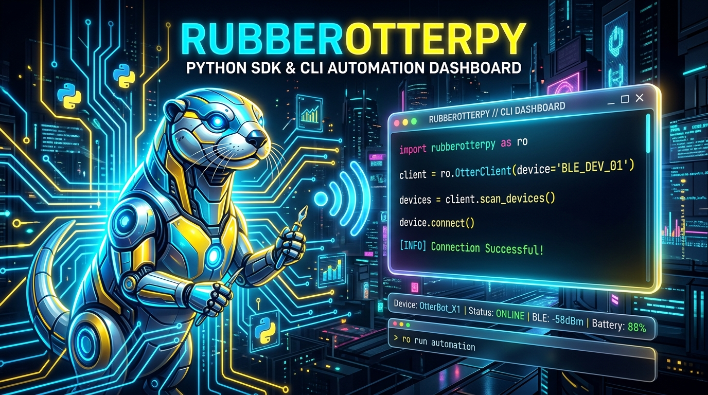

<p align="center">
  
</p>

# 🦦 RubberOtterPy — Comprehensive Python SDK, CLI & Web Dashboard

[](https://www.python.org/)
[](LICENSE)
[](https://platformio.org/)
[](https://en.wikipedia.org/wiki/Bluetooth_Low_Energy)

**RubberOtterPy** is a modular, production-grade Python package that provides an **inline Python SDK**, a feature-rich **CLI tool**, and an embedded **Single Page Web Dashboard (`OtterDeck`)** for discovering, controlling, and managing Rubber Otter microcontrollers (SparkFun Pro Micro / Arduino Leonardo) over **Bluetooth LE (BLE HM-10 / BT05)** and USB CDC Serial.

---

## 📌 Table of Contents

- [🚀 Quick Start](#-quick-start)
- [✨ Key Capabilities](#-key-capabilities)
- [🐍 Python SDK Examples](#-python-sdk-examples)
- [🛠️ CLI Subcommands Guide](#%EF%B8%8F-cli-subcommands-guide)
- [🌐 Web Dashboard (`OtterDeck`)](#-web-dashboard-otterdeck)
- [🔌 C++ Arduino Firmware (`RubberOtter.ino`)](#-c-arduino-firmware-rubberotterino)
- [🧪 Running Unit Tests](#-running-unit-tests)
- [📖 Documentation Links](#-documentation-links)
- [🇹🇷 Türkçe Açıklama](#-türkçe-açıklama)

---

## 🚀 Quick Start

### Installation

```bash
cd /Users/atacan/PycharmProjects/RubberOtterPy
pip install -e .
```

---

## ✨ Key Capabilities

| Category | Features & Commands | Description |
| :--- | :--- | :--- |
| **Transport** | `BLE Direct`, `USB Serial`, `--raw`, `--no-ack` | Direct wireless BLE connection over HM-10/BT05 GATT or USB CDC Serial. Supports un-framed text payloads and no-ACK modes. |
| **Haptics** | `vibrate <ms>` | Triggers vibration motor haptic bursts (50ms - 1000ms). |
| **Keyboard** | `type "<text>"`, `press <key>`, `combo <keys>` | USB HID Keyboard emulation with unescaping (`\n`, `\t`) and key shortcuts (Spotlight, Lock Screen, Copy/Paste). |
| **Mouse** | `mouse left/right`, `mouse move`, `mouse wheel` | Virtual mouse clicker, relative movement, and scroll wheel. |
| **Jiggler** | `jiggler start/stop/toggle` | Background non-blocking USB Mouse Jiggler mode. |
| **Media** | `Play/Pause`, `Next/Prev`, `Vol Up/Down`, `Mute` | Dedicated media and volume controls. |
| **Clicker** | `Start (F5)`, `Next/Prev Slide`, `Black/White Screen` | Dedicated presenter clicker deck. |
| **Macros** | `macro list`, `macro save`, `macro run` | Persistent EEPROM macro slot storage (`m0`..`m5`). |

---

## 🐍 Python SDK Examples

### Synchronous Client (`RubberOtter`)

```python
from rubberotter import RubberOtter

# Connects via BLE auto-detection to nearby Rubber Otter device
with RubberOtter() as otter:
    # 1. Type text via USB HID Keyboard
    otter.type("Hello from RubberOtterPy!\n")

    # 2. Delay execution on MCU
    otter.delay(200)

    # 3. Trigger vibration motor haptics (150ms)
    otter.vibrate(150)

    # 4. Control virtual mouse clicker & scroll wheel
    otter.mouse_click("left")
    otter.mouse_move(wheel=1)

    # 5. Toggle background Mouse Jiggler
    otter.jiggler_toggle()

    # 6. Save & Run persistent EEPROM macro
    otter.macro_save("m0", 'vibrate 150 && type "pass123\n"')
    otter.macro_run("m0")
```

### Asynchronous Client (`AsyncRubberOtter`)

```python
import asyncio
from rubberotter import AsyncRubberOtter

async def main():
    async with AsyncRubberOtter(use_ble=True) as otter:
        res = await otter.type_async("Async typing payload over BLE\n")
        print("ACK Response:", res)
        await otter.vibrate_async(200)

asyncio.run(main())
```

---

## 🛠️ CLI Subcommands Guide

Execute via `rubberotter` or `python3 -m rubberotter`:

```bash
# Discover BLE devices & USB Serial ports
rubberotter scan

# Direct BLE command (auto-detects BLE device or use --ble-address / -b)
rubberotter vibrate 200
rubberotter -b 60F9F128-5B7C-1258-10D5-2694444599B7 vibrate 200

# Raw payload mode (for simple custom Arduino sketches)
rubberotter send "vibrate 200" --raw --no-ack

# Send typing and framed commands over BLE
rubberotter type "Hello World\n"
rubberotter send "delay 100"

# Control Mouse Jiggler & Vibration
rubberotter jiggler toggle
rubberotter vibrate 200

# EEPROM Macro Management
rubberotter macro list
rubberotter macro save m0 'type "pass123\n"'
rubberotter macro run m0

# Change Advertised Bluetooth Name
rubberotter ble-name "Otter_Pro"

# REPL Interactive Prompt
rubberotter shell

# Launch Web Dashboard Server
rubberotter serve --web-port 8080
```

---

## 🌐 Web Dashboard (`OtterDeck`)

Launch the embedded single page web application:

```bash
rubberotter serve --web-port 8080
```
Open **[http://127.0.0.1:8080](http://127.0.0.1:8080)** in your web browser.

### Features Deck
- 📡 **Device Connection Deck**: BLE device (`BT05` / `Otter`) and USB CDC Serial port auto-scan & 1-click connect with button loaders.
- ⚙️ **Raw & No-ACK Mode Toggles**: Checkboxes for transmitting raw un-framed string commands or skipping ACK waiting.
- 📳 **Haptics & Jiggler Controls**: Vibration motor slider (50ms - 1000ms) and Mouse Jiggler toggle badge.
- 🎵 **Media & Music Controls**: Play/Pause, Next/Prev Track, Volume Up/Down, Mute.
- 📊 **Presentation Controls (Clicker)**: Start (F5), Next/Prev Slide, Black/White Screen, Exit (Esc).
- 🖱️ **Virtual Mouse Deck**: Left/Right click and Scroll Up/Down.
- ⌨️ **Keyboard Text Typing Deck**: Multi-line text box with Quick Example Presets.
- 💻 **Raw Command Executor Deck**: Raw payload input with Quick Command Presets.
- 💾 **EEPROM Macro Manager**: Macro slots (`m0`..`m5`) located on the left column with default example sequences.
- 📟 **Live Log Feed**: Real-time packet execution log console.

---

## 🔌 C++ Arduino Firmware (`RubberOtter.ino`)

Complete C++ code for ATmega32U4 (SparkFun Pro Micro / Arduino Leonardo) connected to BT05 BLE module (SoftwareSerial RX: Pin 8, TX: Pin 9) and Vibration Motor (Pin 2).

See complete firmware guide: **[`docs/FIRMWARE_ARDUINO.md`](file:///Users/atacan/PycharmProjects/RubberOtterPy/docs/FIRMWARE_ARDUINO.md)**

---

## 🧪 Running Unit Tests

```bash
.venv/bin/python -m unittest discover -s tests -p "test_*.py"
```

---

## 📖 Documentation Links

- 🐍 **[Python SDK API Reference](file:///Users/atacan/PycharmProjects/RubberOtterPy/docs/PYTHON_SDK.md)**
- 🛠️ **[CLI User Manual](file:///Users/atacan/PycharmProjects/RubberOtterPy/docs/CLI_GUIDE.md)**
- 🌐 **[Web Dashboard & REST API Manual](file:///Users/atacan/PycharmProjects/RubberOtterPy/docs/WEB_APP.md)**
- 🔌 **[C++ Arduino Firmware Guide](file:///Users/atacan/PycharmProjects/RubberOtterPy/docs/FIRMWARE_ARDUINO.md)**

---

## 🇹🇷 Türkçe Açıklama

**RubberOtterPy**, ATmega32U4 (SparkFun Pro Micro / Arduino Leonardo) mikrodenetleyicileri üzerindeki Rubber Otter donanımını **Bluetooth LE (HM-10 / BT05)** ve USB Seri Port üzerinden kablosuz yönetmenizi sağlayan kapsamlı bir Python paketidir.

### Neler Yapılabilir?
1. **Kablosuz Bluetooth LE (BLE) Bağlantısı:** USB kablosu takılı olmasa bile cihazla doğrudan GATT üzerinden haberleşir.
2. **Titreme & Haptik Geri Bildirim:** `vibrate 200` ile Pin 2 üzerindeki titreşim motorunu milisaniye bazında çalıştırır.
3. **USB HID Klavye & Fare Emülasyonu:** Ekrana metin yazar (`type`), özel kısayolları çalıştırır (`press GUI space`, `press GUI l`), sanal fare tıklaması ve kaydırma yapar.
4. **Mouse Jiggler Modu:** Bilgisayarın uykuya geçmesini önleyen arka plan fare hareketini açar/kapatır (`jiggler toggle`).
5. **Medya & Sunum Kumandası:** Şarkı yürütme/durdurma, ses seviyesi değiştirme ve slayt geçişi kumandası olarak çalışır.
6. **EEPROM Makroları:** Sık kullanılan komut dizilimlerini mikrodenetleyicinin EEPROM hafızasına kaydeder (`macro save m0 ...`) ve tek komutla çalıştırır (`macro run m0`).
7. **Web Dashboard (`OtterDeck`):** `rubberotter serve` komutuyla başlatılan gelişmiş tarayıcı arayüzü ve REST API desteği.
