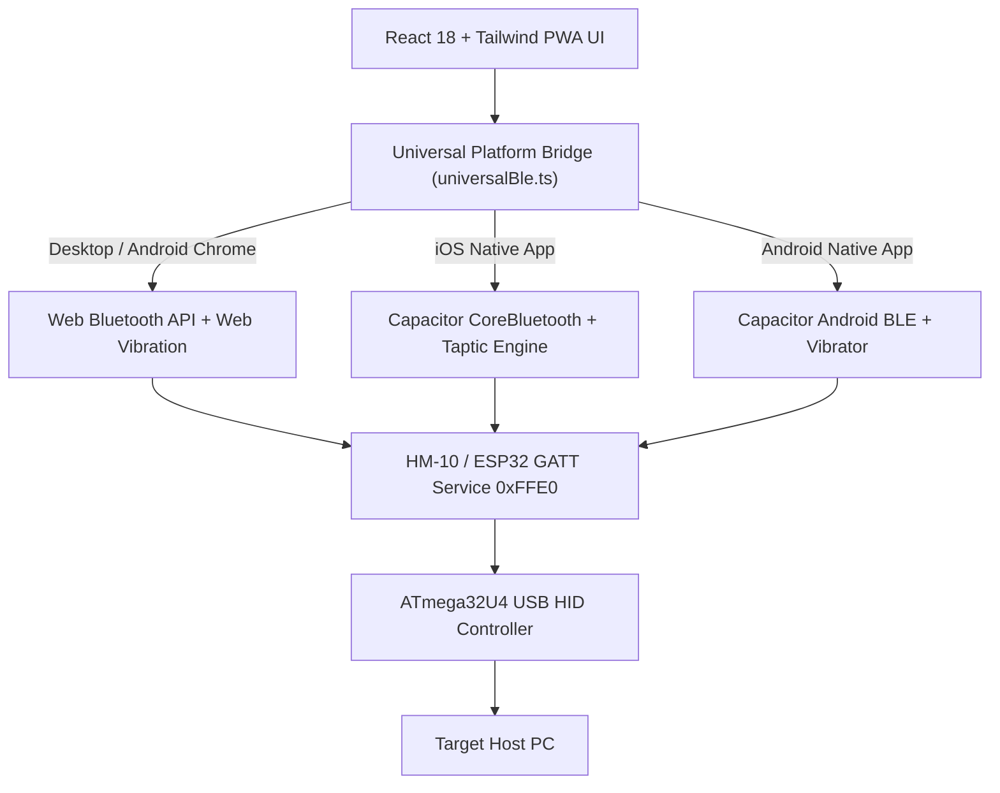

[← Back to Root Repository](../README.md)

# Rubber Otter Web Workstation and Mobile Bridge

Progressive Web Application (PWA) and native mobile frontend for the Rubber Otter ecosystem, built with React 18, Vite, TypeScript, Tailwind CSS, and Ionic Capacitor 8.

## Table of Contents

- [Overview](#overview)
- [Architecture and Transport Bridge](#architecture-and-transport-bridge)
- [Workstation Features](#workstation-features)
- [Development Setup](#development-setup)
- [Build and Packaging Commands](#build-and-packaging-commands)
- [Single-Byte Protocol Mapping](#single-byte-protocol-mapping)
- [License](#license)

## Overview

Rubber Otter Web connects Chromium desktop browsers directly to HM-10 or ESP32 Bluetooth Low Energy modules using the Web Bluetooth API. When packaged natively through Capacitor, the interface bridges to iOS CoreBluetooth and Android BLE without relying on Web Bluetooth support in mobile WebViews.

## Architecture and Transport Bridge



## Workstation Features

- **Header-Integrated Navigation**: Desktop multi-pane switching built into the navigation bar with an ergonomic mobile bottom navigation bar.
- **Native Mobile Packaging**: Direct CoreBluetooth support on iOS and native Android BLE service integration.
- **Five Interface Localizations**: Zero-reload runtime language selection across English, Turkish, German, French, and Spanish.
- **Adaptive Dual-Theme Engine**: Obsidian Dark (`#09090b`), Clean White (`#ffffff`), and system theme synchronization.
- **Keystroke Stream Injector**: Real-time typing injection, auto-enter toggle, snippet shortcuts, and execution duration calculation.
- **Media Deck**: Controls for Play/Pause, Next/Previous Track, Volume Adjustments, and Mute.
- **Presentation Clicker**: Next/Previous slide triggers, fullscreen presentation mode (`F5`), blank display toggle (`B`), and integrated stopwatch timer.
- **Virtual Trackpad**: Relative mouse cursor tracking with multi-touch gestures (tap for left click, two-finger tap for right click), vertical scroll wheel, and sensitivity adjustment.
- **Zero-Install Web Flasher**: Web Serial API firmware uploader with 1200bps Caterina bootloader trigger for ATmega32U4 Pro Micro and Leonardo boards.
- **Packet Terminal**: Real-time hex telemetry monitor displaying sent and received bytes, timestamps, and copyable debug buffers.

## Development Setup

### Prerequisites

- Node.js 20+
- npm 10+

### Local Dev Server

```bash
# Install dependencies
npm install

# Start Vite development server
npm run dev
```

Open `http://localhost:3000` in Google Chrome, Microsoft Edge, or another Chromium browser with Web Bluetooth enabled.

## Build and Packaging Commands

```bash
# Type check and build web distribution bundle
npm run build

# Build web distribution and stage in ../dist/web/
npm run build:web

# Sync web build to native iOS and Android projects
npm run cap:sync

# Build native Android APK (requires JDK 21)
npm run build:android

# Build native iOS app bundle (requires macOS and Xcode)
npm run build:ios

# Open native projects in IDEs
npm run cap:open:android
npm run cap:open:ios
```

## Single-Byte Protocol Mapping

The web client emits single-byte hex commands for quick actions:

| Category | Action | Hex Code | Host Execution |
| :--- | :--- | :--- | :--- |
| **Media** | Play / Pause | `0x11` | Media Play/Pause key |
| | Next Track | `0x12` | Media Next Track |
| | Previous Track | `0x13` | Media Previous Track |
| | Volume Up / Down | `0x14` / `0x15` | Media Volume step |
| | Mute Toggle | `0x16` | Media Mute |
| **Presentation** | Next / Prev Slide | `0x21` / `0x22` | Right / Left Arrow |
| | Fullscreen / Black | `0x23` / `0x24` | F5 / 'B' |
| **Security** | Lock Screen | `0x31` | `Win + L` / `Ctrl + Cmd + Q` |
| | Mouse Jiggler | `0x32` | Periodic micro-movements |
| | Task Manager | `0x33` | `Ctrl + Shift + Esc` / `Cmd + Opt + Esc` |
| | Show Desktop | `0x34` | `Win + D` / `Cmd + F3` |
| | Vibration Pulse | `0x35` | Pin 2 haptic pulse |
| **Gaming** | CS Buy Macro | `0x41` | Buy sequence (`'b' -> 4 -> 2`) |
| **Trackpad** | Move Vector | `0x80` | `[0x80, deltaX, deltaY]` relative move |
| | Left / Right Click | `0x81` / `0x82` | `Mouse.click(MOUSE_LEFT / RIGHT)` |
| | Scroll Up / Down | `0x84` / `0x85` | `Mouse.move(0, 0, 1 / -1)` |

## License

This project is licensed under the Apache License, Version 2.0. See [LICENSE](../LICENSE) for details.
